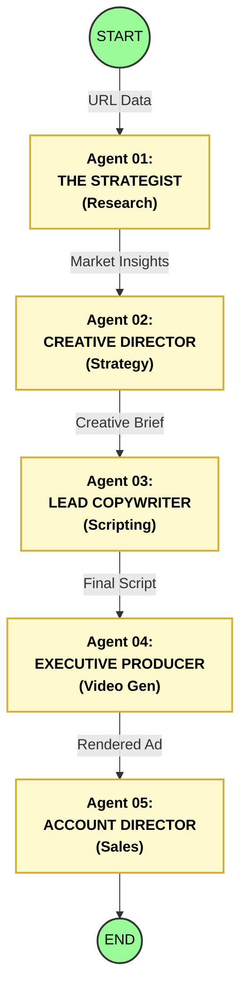

# Advataria: Autonomous AI Advertising Swarm

### 🏗 Architecture Overview
Advataria operates as a multi-agent system designed to automate the entire lifecycle of video advertising—from initial brand research to final client delivery.

We have digitized the core roles of a creative studio. Unlike linear automation scripts, our architecture utilizes **5 Specialized Autonomous Agents** that act as a cohesive workforce, effectively replacing the traditional agency headcount with software.

### 🤖 The "Agency in a Box" Architecture

### 🧠 Agent Roles & Logic

* **🕵️‍♂️ Agent 01: THE STRATEGIST**
  * **Role:** Scrapes target URLs, analyzes brand tone-of-voice, and extracts key product data.
  * **Function:** Replaces the Market Researcher. Instead of weeks of focus groups, it scrapes and analyzes brand data in seconds.

* **📐 Agent 02: CREATIVE DIRECTOR**
  * **Role:** Processes raw data to identify customer pain points and builds the campaign logic (USP).
  * **Function:** Replaces the expensive CD. It defines the marketing angle and distinct USP logic.

* **✍️ Agent 03: LEAD COPYWRITER**
  * **Role:** Compiles the creative brief into high-conversion video scripts, hooks, and localized copy.
  * **Function:** Replaces the freelance writer. It crafts viral hooks and scripts optimized for conversion.

* **🎬 Agent 04: EXECUTIVE PRODUCER**
  * **Role:** The heavy lifter. Orchestrates generative video models (Google Vertex AI / Sora / Veo) and avatar engines to render the final asset.
  * **Function:** Replaces the video production crew. Registered on **Fetch.ai Almanac** to offer GPU compute to the network.

* **🤝 Agent 05: ACCOUNT DIRECTOR**
  * **Role:** Handles distribution, personalized outreach, and royalty settlements on-chain.
  * **Function:** Replaces the sales rep and account manager.

### 🔌 Tech Stack & Integration Roadmap
* **Orchestration:** LangChain & Python microservices.
* **AI Models:** Google Vertex AI, OpenAI Sora™, HeyGen API.
* **Decentralized Infrastructure (In Progress):**
    * **Fetch.ai uAgents:** Migrating inter-agent communication to the uAgents protocol for asynchronous task handling.
    * **AgentKit (Base):** Implementing on-chain royalty settlements for avatar licenses and ad payments.
    * **NVIDIA Optimization:** Optimizing Agent 04 for high-throughput GPU rendering.

---
*Built publicly by the Advataria Team.*
